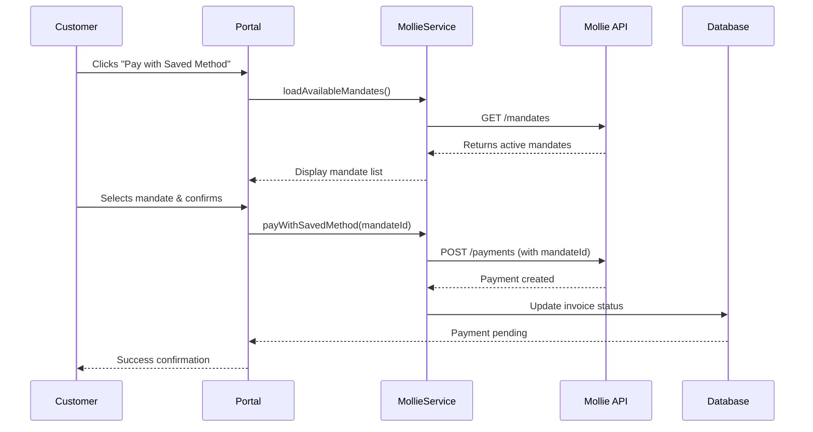

## Overview

Saved Payment Methods allow your customers to pay invoices quickly using previously authorized SEPA Direct Debit mandates. Instead of creating a new payment method each time, customers can select from their existing mandates, making repeat payments faster and more convenient.

<Tip>
This feature is perfect for recurring customers, subscriptions, and businesses that send frequent invoices to the same clients. It reduces friction and increases payment success rates.
</Tip>

## How It Works

### For Customers

1. **First Payment**: Customer pays an invoice via SEPA Direct Debit
2. **Mandate Created**: Mollie automatically creates and stores a mandate
3. **Future Payments**: Customer sees "Saved Payment Methods" option on invoices
4. **Quick Payment**: Select saved mandate → Confirm → Payment processed instantly

### For Business Owners

The system works automatically:
- No configuration required
- Mandates are created during first SEPA payment
- Saved methods appear automatically for returning customers
- Full transaction history and audit trail maintained

<Info>
Saved payment methods only apply to **SEPA Direct Debit** mandates. Credit card and other payment methods do not support saved credentials in the same way.
</Info>

## Payment Flow

### Step 1: Customer Receives Invoice

When a customer views an unpaid invoice in their portal, they see two payment options:

- **Pay with New Method**: Standard payment flow with Mollie checkout
- **Pay with Saved Method**: Quick payment using existing mandate

### Step 2: Selecting a Saved Method

If the customer has active SEPA mandates:

1. Click **"Pay with Saved Payment Method"** button
2. Modal appears showing all available mandates
3. Each mandate displays:
   - Mandate ID (e.g., `mdt_abc123xyz`)
   - Bank account details (masked: `NL**ABNA0123456789`)
   - Creation date
   - Status (Active/Pending/Expired)

### Step 3: Confirming Payment

1. Customer selects a mandate from the list
2. Clicks **"Confirm Payment"**
3. System creates payment using selected mandate
4. Invoice status updates to "Pending" immediately
5. Payment processes through Mollie

### Step 4: Payment Confirmation

**Successful Payment:**
- Invoice marked as "Paid"
- Transaction recorded in payment history
- Email notification sent (if configured)
- Customer redirected to invoice overview

**Failed Payment:**
- Error message displayed
- Invoice remains "Open" or "Pending"
- Customer can retry with different mandate or new payment method

## Customer Experience

### Customer Portal Interface

**Invoice Detail Page** (`/shop/{handle}/portal/invoices/{id}`):

<CardGroup cols={2}>
  <Card title="Payment Button States" icon="toggle-on">
    **Available** (Blue)
    - Default state
    - Clickable and ready
    - Shows "Pay with Saved Payment Method"

    **Processing** (Gray)
    - Payment in progress
    - Button disabled
    - Shows "Processing..."

    **Completed** (Green)
    - Payment succeeded
    - Invoice marked as paid
    - Button hidden
  </Card>

  <Card title="Payment Method Modal" icon="window">
    **Modal Contents:**
    - List of active mandates
    - Mandate details (ID, bank, date)
    - "Cancel" button to close
    - "Confirm Payment" button

    **Real-time Updates:**
    - Loading states during fetch
    - Error messages inline
    - Success confirmation
  </Card>
</CardGroup>

### Mobile-Friendly Design

The saved payment method interface is fully responsive:

- Touch-friendly buttons (minimum 44px tap target)
- Modal adapts to screen size
- Clear visual feedback for all actions
- Works on iOS, Android, and desktop browsers

## Mandate Management

### What is a Mandate?

A **SEPA mandate** is an authorization from a customer allowing you to automatically debit their bank account. It's created during the first SEPA Direct Debit payment and can be reused for future payments.

<Info>
Mandates are regulated by SEPA (Single Euro Payments Area) regulations and must comply with EU banking standards.
</Info>

### Mandate Statuses

| Status | Description | Can Use for Payment? |
|--------|-------------|---------------------|
| **Valid** | Active and ready to use | ✅ Yes |
| **Pending** | Awaiting bank verification | ❌ No (use after verification) |
| **Expired** | No longer valid | ❌ No |
| **Canceled** | Revoked by customer or business | ❌ No |

### How Mandates Are Created

**Automatic Creation via Mollie:**

1. Customer selects SEPA Direct Debit at checkout
2. Mollie redirects to bank for authorization
3. Customer authorizes direct debit
4. Mollie creates mandate and links to customer
5. Mandate becomes available for future payments

**When are Mandates Created?**

- First SEPA payment for subscription
- SEPA invoice payment
- SEPA order payment in shop
- Manual SEPA setup (via Mollie dashboard)

### Viewing Active Mandates

**For Business Owners:**

Navigate to **Settings** → **Payment Providers** → **Mollie** → **Mandates**

View all mandates including:
- Customer name and email
- Mandate ID
- Bank account (masked)
- Status and creation date
- Linked subscriptions/invoices

**For Customers:**

Mandates appear automatically when viewing unpaid invoices in the customer portal. No separate mandate management page needed.

## Technical Details

### System Architecture

**Key Components:**

- **ShopCustomerInvoiceDetail Component**: Livewire component handling UI and payment processing
- **MollieService**: Handles API communication with Mollie
- **Mandate Loading**: Fetches active mandates via Mollie API
- **Payment Creation**: Creates payments using mandate ID
- **Duplicate Prevention**: Ensures no concurrent payments for same invoice

### Payment Processing Flow



### API Integration

PayRequest integrates with Mollie's Customers API to manage mandates:

**Endpoints Used:**
- `GET /v2/customers/{customerId}/mandates` - Fetch customer mandates
- `POST /v2/payments` - Create payment with mandate ID
- `GET /v2/mandates/{mandateId}` - Verify mandate status

**Authentication:**
- OAuth 2.0 access tokens (auto-refreshed)
- API keys stored encrypted in database
- Per-business provider credentials

### Security Features

<CardGroup cols={2}>
  <Card title="Duplicate Prevention" icon="shield-check">
    - Prevents multiple simultaneous payments
    - Checks invoice payment status before creating payment
    - Validates mandate belongs to customer
    - Ensures mandate is active and valid
  </Card>

  <Card title="Error Handling" icon="triangle-exclamation">
    - Comprehensive error catching
    - User-friendly error messages
    - Automatic retry suggestions
    - Logs all failed attempts
  </Card>

  <Card title="Audit Trail" icon="list-check">
    - All payments logged in transactions table
    - Activity log tracks payment attempts
    - Mandate usage tracked per invoice
    - Full transaction history maintained
  </Card>

  <Card title="Data Privacy" icon="lock">
    - Bank account numbers masked in UI
    - Mandate IDs encrypted in database
    - GDPR-compliant data handling
    - Secure communication with Mollie
  </Card>
</CardGroup>

## Use Cases

### 1. Recurring Service Providers

**Scenario:** Monthly consulting services with variable amounts

**Benefit:**
- Customers pay new invoices with one click
- No need to re-enter bank details each month
- Faster payment processing
- Reduced payment failures

**Example:**
```
Business: Web Development Agency
Customer: SaaS Startup
Invoice: €2,500 for March development work
Payment: Customer uses saved mandate from previous month
Result: Payment processed same day
```

### 2. Subscription Businesses

**Scenario:** Annual subscriptions with add-on purchases

**Benefit:**
- Main subscription uses mandate automatically
- Add-on invoices can reuse same mandate
- Consistent payment method across all charges
- Higher payment success rate

**Example:**
```
Business: SaaS Platform (€20/month)
Customer: Small Business
Invoice: €50 for additional user licenses
Payment: Uses subscription mandate
Result: Instant payment confirmation
```

### 3. Service Businesses with Deposits

**Scenario:** Project-based work with upfront deposits

**Benefit:**
- Initial deposit creates mandate
- Final invoice uses same mandate
- No payment friction at project completion
- Professional client experience

**Example:**
```
Business: Design Studio
Customer: E-commerce Company
Invoice 1: €1,000 deposit (creates mandate)
Invoice 2: €4,000 final payment (uses saved mandate)
Result: Smooth payment experience
```

## Troubleshooting

### Customer Can't See Saved Payment Methods

**Possible Causes:**

1. **No Active Mandates**
   - Customer has never paid via SEPA
   - Previous mandates expired or canceled
   - Mandates belong to different Mollie customer

2. **Wrong Customer Account**
   - Customer logged into wrong portal
   - Email mismatch between PayRequest and Mollie
   - Multiple customer accounts exist

3. **Mollie Connection Issue**
   - Mollie provider inactive
   - OAuth token expired (auto-refresh failed)
   - API credentials invalid

**Solutions:**

<Accordion title="Verify Mandate Exists in Mollie">
  1. Log into Mollie dashboard
  2. Navigate to Customers
  3. Search for customer email
  4. Check Mandates tab
  5. Verify status is "Valid"
</Accordion>

<Accordion title="Check PayRequest-Mollie Customer Sync">
  1. Go to Settings → Payment Providers → Mollie
  2. Ensure "Sync Customers" is enabled
  3. Click "Test Connection" to verify
  4. Check customer record in PayRequest dashboard
  5. Verify `mollie_customer_id` field is populated
</Accordion>

<Accordion title="Refresh Mollie Connection">
  1. Navigate to Settings → App Store → Mollie
  2. Click "Test Connection"
  3. If failed, click "Reconnect"
  4. Complete OAuth flow
  5. Retry payment
</Accordion>

### Payment Fails with Saved Mandate

**Common Error Messages:**

**"Mandate is no longer valid"**
- Mandate expired or revoked by bank
- Customer needs to create new mandate
- Solution: Pay with new payment method

**"Insufficient funds"**
- Customer's bank account balance too low
- SEPA direct debit declined by bank
- Solution: Customer should check bank account

**"Payment already exists for this invoice"**
- Duplicate payment attempted
- System prevented double-charging
- Solution: Refresh page, check invoice status

**"Unable to create payment"**
- Mollie API error or timeout
- Temporary service disruption
- Solution: Wait 5 minutes and retry

### Mandate Shows as "Pending"

**What it means:**
- Bank hasn't confirmed authorization yet
- Usually takes 1-3 business days
- Customer can use mandate after confirmation

**Next steps:**
- Wait for bank verification
- Use alternative payment method meanwhile
- Check Mollie dashboard for status updates

<Warning>
Never manually mark invoices as paid while using saved payment methods. Always wait for Mollie webhook confirmation to ensure payment actually succeeded.
</Warning>

## Best Practices

### For Business Owners

<CardGroup cols={2}>
  <Card title="Enable Customer Sync" icon="arrows-rotate">
    Turn on Mollie customer sync to automatically link customers between PayRequest and Mollie. This ensures mandates appear correctly.
  </Card>

  <Card title="Test Before Going Live" icon="flask">
    Use Mollie test mode to verify saved payment methods work correctly before processing real payments.
  </Card>

  <Card title="Monitor Mandate Health" icon="heartbeat">
    Regularly check mandate statuses in Mollie dashboard. Replace expired mandates before they cause payment failures.
  </Card>

  <Card title="Educate Customers" icon="graduation-cap">
    Inform customers about saved payment methods in onboarding emails. Explain the convenience and security benefits.
  </Card>
</CardGroup>

### For Customers

- **Keep bank details current**: Update mandate if you change banks
- **Monitor email notifications**: Check for payment confirmations
- **Contact business if issues**: Don't repeatedly retry failed payments
- **Understand processing time**: SEPA payments take 1-3 business days

## Security & Compliance

### SEPA Regulations

PayRequest complies with SEPA mandate regulations:

- ✅ **Pre-notification**: Customers receive advance notice of charges
- ✅ **Mandate Reference**: Unique ID for each authorization
- ✅ **Revocation Rights**: Customers can cancel mandates anytime
- ✅ **Dispute Process**: SEPA chargeback rights preserved

### Data Protection

**Encrypted Storage:**
- Mandate IDs encrypted at rest (AES-256)
- Bank account numbers masked in all interfaces
- API credentials stored encrypted

**Access Control:**
- Only customer can use their own mandates
- Business owners see aggregated data only
- Multi-tenant isolation enforced

**Audit Logging:**
- All payment attempts logged
- Mandate usage tracked
- Failed payments recorded with reasons

### PCI Compliance

PayRequest **never stores** sensitive bank account details:

- Bank data stays with Mollie (PCI-DSS Level 1 certified)
- Only mandate IDs stored in PayRequest
- No direct access to customer bank accounts
- All payment processing handled by Mollie

<Info>
By using Mollie mandates, PayRequest maintains PCI compliance without needing to store sensitive payment information.
</Info>

## Frequently Asked Questions

<AccordionGroup>
  <Accordion title="Can customers use saved methods for subscriptions?">
    Yes! Subscriptions automatically create and use mandates for recurring payments. The same mandate can be used for both subscription charges and one-off invoice payments.
  </Accordion>

  <Accordion title="What happens if a customer cancels their mandate?">
    The mandate will no longer appear in saved payment methods. The customer will need to create a new mandate by making a new SEPA payment, or use a different payment method.
  </Accordion>

  <Accordion title="How long do mandates remain active?">
    SEPA mandates remain valid indefinitely unless:
    - Customer revokes the mandate
    - Bank account is closed
    - 36 months pass without any payments (dormancy)
    - Business manually cancels the mandate
  </Accordion>

  <Accordion title="Can I manually create mandates for customers?">
    No. Mandates must be created through the standard SEPA Direct Debit payment flow via Mollie. This ensures proper authorization and compliance with SEPA regulations.
  </Accordion>

  <Accordion title="Do saved payment methods work with other payment types?">
    Currently, only SEPA Direct Debit mandates support saved payment methods. Credit cards, iDEAL, and other payment methods do not offer saved credentials in the same way.
  </Accordion>

  <Accordion title="Can customers have multiple saved mandates?">
    Yes! Customers can have multiple mandates (e.g., personal and business bank accounts). They can choose which mandate to use for each payment.
  </Accordion>

  <Accordion title="What's the difference between saved mandates and subscriptions?">
    **Subscriptions** are recurring payments that automatically charge on schedule. **Saved mandates** allow one-click manual payments on individual invoices. Both use SEPA mandates but serve different purposes.
  </Accordion>
</AccordionGroup>

## Related Documentation

<CardGroup cols={3}>
  <Card title="SEPA Mandates" icon="file-contract" href="/subscriptions/managing-mandates">
    Learn more about mandate management
  </Card>

  <Card title="Mollie Integration" icon="credit-card" href="/payment-processing/setting-up-payment-providers">
    Set up Mollie for your business
  </Card>

  <Card title="Customer Portal" icon="user" href="/customer-management/customer-portal">
    Configure customer portal settings
  </Card>

  <Card title="Invoice Payments" icon="file-invoice" href="/invoices/creating-invoices">
    Create and manage invoices
  </Card>

  <Card title="Subscriptions" icon="arrows-rotate" href="/subscriptions/creating-subscriptions">
    Set up recurring billing
  </Card>

  <Card title="App Store" icon="store" href="/business-settings/app-store">
    Manage payment provider integrations
  </Card>
</CardGroup>

---

<Info>
**Need Help?** If you're experiencing issues with saved payment methods, contact [support@payrequest.io](mailto:support@payrequest.io) with the invoice ID and customer email for assistance.
</Info>
